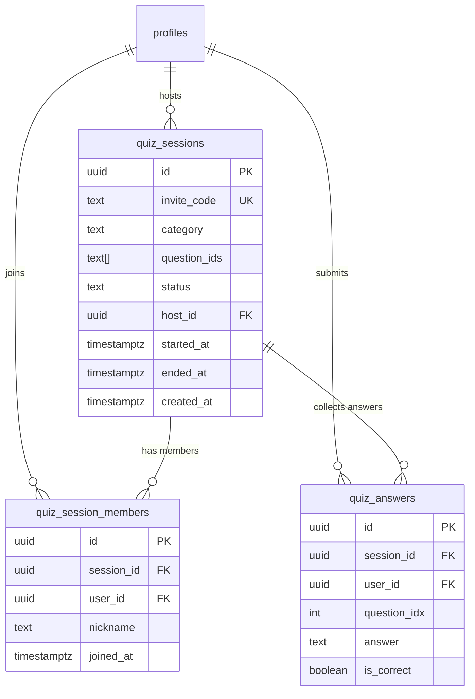

# feat: Multiplayer Islamic Quiz (Musabaqah) ✨

## Overview

Add a 2-player Islamic knowledge quiz feature called **Musabaqah** (مُسَابَقَة — competition/race). A user creates a session, selects a category, and shares a 6-character invite code. The friend joins and both race independently through 30 questions within a **3-minute timer**. Whoever answers more correctly wins. Scores are revealed at the end, then all session data is deleted.

Entry point: **Dashboard card** (not a new nav tab).

---

## Decisions Made

| Question | Decision |
|---|---|
| Progression model | **Independent** — each player races at their own pace |
| Time limit | **3 minutes total** for all 30 questions |
| Question authority | **Creator** selects category → app randomly picks 30 questions → question IDs stored in session row → both clients fetch same set |
| Creator disconnects mid-game | Creator's last submitted score is shown at results time |
| Data persistence | **Deleted after both players see the results screen** |
| Answer feedback | **Yes** — correct/incorrect shown after each answer |
| Opponent status mid-game | **No** "opponent has answered" indicator |
| Entry point | **Dashboard card** |
| Creator can cancel lobby | **No** — locked until quiz ends |
| Invite code length | **6 characters** |
| Question bank | **~300 questions** in static TypeScript content files, randomly fetched |
| Categories at launch | **2 categories for MVP** (General Islamic Knowledge + Prophet Stories), expand later |

---

## Proposed Solution

```
Creator:
  Dashboard card → Create Session → Pick Category → Get 6-char Code → Lobby (locked)
     ↓ (app selects 30 random questions, stores IDs in DB)
  Friend joins → Both receive same question set → 3-minute countdown starts
  Each player answers independently → Timer ends → Results shown → Data deleted

Joiner:
  Dashboard card → Enter Code → Join Lobby → Wait for creator to start
     ↓
  Same question set fetched → 3-minute countdown → Same results flow
```

---

## Question Categories (MVP = 2, expandable)

| # | Category | Status | Description |
|---|---|---|---|
| 1 | **General Islamic Knowledge** | ✅ MVP | 5 Pillars, Articles of Faith, basic worship |
| 2 | **Prophet Stories** | ✅ MVP | Stories of prophets in the Quran |
| 3 | Quran Knowledge | Post-MVP | Surahs, verses, revelation facts |
| 4 | Islamic History | Post-MVP | Companions, caliphs, early events |
| 5 | Sunnah & Daily Life | Post-MVP | Du'a, manners, hadith practices |
| 6 | Names of Allah | Post-MVP | The 99 names and meanings |

**Bank size:** ~150 questions per MVP category (300 total). Each session randomly draws 30 from the chosen category. Questions stored as static TypeScript content files (`src/content/quiz/`).

---

## Technical Approach

### File Structure

```
src/
  pages/
    MusabaqahPage.tsx           ← landing | lobby | quiz | results (single page, 4 views)
  components/
    musabaqah/
      MusabaqahLobby.tsx        ← waiting room, invite code display, start button
      MusabaqahQuiz.tsx         ← 3-min timer + 30 questions inline (no child component)
      MusabaqahResults.tsx      ← X/30 vs Y/30, winner text only
  hooks/
    useMusabaqah.ts             ← all session CRUD + Supabase Realtime in ONE hook
  lib/
    api/
      musabaqah.api.ts          ← createSession, joinByCode, submitAnswer, getResults
  content/
    quiz/
      general-islam-data.ts     ← 150 questions
      prophet-stories-data.ts   ← 150 questions
      index.ts                  ← selectQuizQuestions(category, count) shuffle utility
  types/
    musabaqah.ts                ← all types incl. QuizEvent union
supabase/migrations/
  012_musabaqah.sql             ← all tables + RLS + RPC in one migration
```

**10 files total** (not 17). Category selector is inlined in `MusabaqahPage.tsx` landing view. Question card is inlined in `MusabaqahQuiz.tsx`.

---

### Database Schema

```sql
-- 012_musabaqah.sql

-- Tables
CREATE TABLE quiz_sessions (
  id             uuid PRIMARY KEY DEFAULT gen_random_uuid(),
  invite_code    text NOT NULL UNIQUE DEFAULT upper(substring(md5(random()::text), 1, 6)),
  category       text NOT NULL CHECK (category IN ('general', 'prophets', 'quran', 'history', 'sunnah', 'names')),
  question_ids   text[] NOT NULL,          -- 30 question IDs selected at creation by host client
  status         text NOT NULL DEFAULT 'lobby' CHECK (status IN ('lobby', 'active', 'finished')),
  host_id        uuid NOT NULL REFERENCES profiles(id) ON DELETE CASCADE,
  started_at     timestamptz,
  ended_at       timestamptz,
  created_at     timestamptz DEFAULT now()
);

CREATE TABLE quiz_session_members (
  id          uuid PRIMARY KEY DEFAULT gen_random_uuid(),
  session_id  uuid NOT NULL REFERENCES quiz_sessions(id) ON DELETE CASCADE,
  user_id     uuid NOT NULL REFERENCES profiles(id) ON DELETE CASCADE,
  nickname    text NOT NULL,
  joined_at   timestamptz DEFAULT now(),
  UNIQUE (session_id, user_id)
);

CREATE TABLE quiz_answers (
  id           uuid PRIMARY KEY DEFAULT gen_random_uuid(),
  session_id   uuid NOT NULL REFERENCES quiz_sessions(id) ON DELETE CASCADE,
  user_id      uuid NOT NULL REFERENCES profiles(id) ON DELETE CASCADE,
  question_idx int NOT NULL CHECK (question_idx BETWEEN 0 AND 29),
  answer       text NOT NULL CHECK (answer IN ('A', 'B', 'C', 'D')),
  is_correct   boolean NOT NULL,   -- computed client-side; verified server-side in RPC
  UNIQUE (session_id, user_id, question_idx)
);

-- Indexes
CREATE INDEX idx_quiz_sessions_invite       ON quiz_sessions(invite_code);
CREATE INDEX idx_quiz_session_members_sess  ON quiz_session_members(session_id);
CREATE INDEX idx_quiz_session_members_user  ON quiz_session_members(user_id);
CREATE INDEX idx_quiz_answers_sess_user     ON quiz_answers(session_id, user_id);

-- RLS
ALTER TABLE quiz_sessions        ENABLE ROW LEVEL SECURITY;
ALTER TABLE quiz_session_members ENABLE ROW LEVEL SECURITY;
ALTER TABLE quiz_answers         ENABLE ROW LEVEL SECURITY;

-- SECURITY DEFINER helper (avoids RLS recursion — same pattern as is_halaqah_member)
CREATE OR REPLACE FUNCTION is_quiz_member(p_session_id uuid, p_user_id uuid)
RETURNS boolean LANGUAGE sql SECURITY DEFINER STABLE SET search_path = public AS $$
  SELECT EXISTS (
    SELECT 1 FROM quiz_session_members
    WHERE session_id = p_session_id AND user_id = p_user_id
  );
$$;

-- Policies: quiz_sessions
CREATE POLICY "members_can_read_session"
  ON quiz_sessions FOR SELECT
  USING (is_quiz_member(id, auth.uid()));

CREATE POLICY "anyone_can_lookup_lobby_by_code"
  ON quiz_sessions FOR SELECT
  USING (auth.uid() IS NOT NULL AND status = 'lobby');  -- enables join-by-code lookup

CREATE POLICY "host_can_create"
  ON quiz_sessions FOR INSERT
  WITH CHECK (host_id = auth.uid());

CREATE POLICY "host_can_update_status"
  ON quiz_sessions FOR UPDATE
  USING (host_id = auth.uid());

-- Policies: quiz_session_members
CREATE POLICY "members_can_read_members"
  ON quiz_session_members FOR SELECT
  USING (is_quiz_member(session_id, auth.uid()));

CREATE POLICY "user_can_join"
  ON quiz_session_members FOR INSERT
  WITH CHECK (user_id = auth.uid());

-- Policies: quiz_answers
CREATE POLICY "members_can_read_answers"
  ON quiz_answers FOR SELECT
  USING (is_quiz_member(session_id, auth.uid()));

CREATE POLICY "user_can_submit_own_answers"
  ON quiz_answers FOR INSERT
  WITH CHECK (user_id = auth.uid());

-- RPC: get results (SECURITY DEFINER so it can see all answers)
CREATE OR REPLACE FUNCTION get_quiz_results(p_session_id uuid)
RETURNS TABLE (user_id uuid, nickname text, score bigint)
LANGUAGE sql SECURITY DEFINER SET search_path = public AS $$
  SELECT
    m.user_id,
    m.nickname,
    COUNT(a.id) FILTER (WHERE a.is_correct = true) AS score
  FROM quiz_session_members m
  LEFT JOIN quiz_answers a ON a.session_id = m.session_id AND a.user_id = m.user_id
  WHERE m.session_id = p_session_id
  GROUP BY m.user_id, m.nickname;
$$;

GRANT EXECUTE ON FUNCTION get_quiz_results(uuid) TO authenticated;
GRANT EXECUTE ON FUNCTION is_quiz_member(uuid, uuid) TO authenticated;

-- Cleanup: delete finished sessions (called from results screen on unmount)
CREATE OR REPLACE FUNCTION delete_quiz_session(p_session_id uuid)
RETURNS void LANGUAGE sql SECURITY DEFINER SET search_path = public AS $$
  DELETE FROM quiz_sessions WHERE id = p_session_id
    AND is_quiz_member(p_session_id, auth.uid());
$$;

GRANT EXECUTE ON FUNCTION delete_quiz_session(uuid) TO authenticated;
```

**Note on `is_correct`:** The client computes and submits `is_correct`. The `get_quiz_results` RPC uses the stored `is_correct` values. Because the question bank is a local TypeScript file (client-side), the client already knows all correct answers regardless — `is_correct` submission from the client is the appropriate pattern here. Future improvement: move correct answers server-side if a DB-backed question table is added.

**Note on 2-player cap:** Enforced in `musabaqah.api.ts` inside `joinByCode`: check member count before inserting. The `UNIQUE(session_id, user_id)` prevents duplicate joins; the application function prevents a third player. (A DB trigger is the belt-and-suspenders option — add post-MVP if needed.)

---

### TypeScript Types

```typescript
// src/types/musabaqah.ts

export type SessionId = string & { readonly _brand: 'SessionId' }
export const SessionId = (id: string): SessionId => id as SessionId

export type QuizCategory = 'general' | 'prophets' | 'quran' | 'history' | 'sunnah' | 'names'

export interface QuizQuestion {
  id: string
  category: QuizCategory
  question: string
  options: { A: string; B: string; C: string; D: string }
  correct: 'A' | 'B' | 'C' | 'D'
  explanation?: string   // shown after player answers
}

export interface QuizSession {
  id: SessionId
  inviteCode: string
  category: QuizCategory
  status: 'lobby' | 'active' | 'finished'
  hostId: string
  questionIds: string[]  // 30 IDs committed at session creation
}

export interface PlayerScore {
  userId: string
  nickname: string
  score: number          // correct answers out of 30
  isMe: boolean
}

export type QuizWinner = 'me' | 'opponent' | 'draw'

// Broadcast event union — used in useMusabaqah realtime channel
export type QuizEvent =
  | { event: 'quiz_start'; payload: { startedAt: number; endsAt: number } }  // endsAt = startedAt + 180_000
  | { event: 'quiz_end';   payload: { endedAt: number } }
```

Only 2 broadcast events — no `next_question` (independent play, no server clock), no `answer_given` (no opponent status indicator).

---

### Hook Design — One Hook

```typescript
// src/hooks/useMusabaqah.ts
// Owns: TanStack Query (lobby/results) + Supabase Realtime (active quiz) in one place

export function useMusabaqah(sessionId: SessionId | null) {
  const channelRef = useRef<RealtimeChannel | null>(null)  // stable ref, no re-subscribe on re-render

  // TanStack Query: session state (lobby + results phase)
  const sessionQuery = useQuery({ ... })

  // Supabase Realtime: Presence for lobby, Broadcast for start/end signal
  useEffect(() => {
    if (!supabase || !sessionId) return
    const ch = supabase.channel(`musabaqah:${sessionId}`, {
      config: { presence: { key: userId } },
    })
    channelRef.current = ch
    // ... subscribe, track presence, listen for quiz_start broadcast
    return () => { supabase.removeChannel(ch); channelRef.current = null }
  }, [sessionId])   // only re-runs when sessionId changes, not on every render

  return { session, members, sendEvent, ... }
}
```

Key: `channelRef` prevents duplicate subscriptions across re-renders. Cleanup always calls `supabase.removeChannel()`.

---

### Realtime Strategy (Minimal)

| Concern | Mechanism |
|---|---|
| Who is in the lobby | Supabase **Presence** (userId as key) |
| Quiz start signal | Supabase **Broadcast** — host sends `quiz_start` with `endsAt` timestamp |
| Quiz end signal | Supabase **Broadcast** — host sends `quiz_end` |
| Answer submission | **DB write** (`quiz_answers`) — source of truth |
| Results fetch | TanStack Query + `get_quiz_results` RPC |
| Session cleanup | `delete_quiz_session` RPC called after results screen |

**Timer:** Host broadcasts `{ startedAt, endsAt }`. Both clients run a local countdown against `endsAt`. When `Date.now() >= endsAt`, the client stops accepting answers and transitions to the results view — **independently of any broadcast**. This handles host disconnection: the timer keeps ticking on the guest's device regardless.

**Channel name:** `musabaqah:{sessionId}`

No `next_question` events (independent play). No `answer_given` events (no opponent indicator). Clean, minimal event surface.

---

### Question Data Structure

```typescript
// src/content/quiz/general-islam-data.ts  (example)
export const GENERAL_ISLAM_QUESTIONS: QuizQuestion[] = [
  {
    id: 'gi-001',
    category: 'general',
    question: 'How many pillars of Islam are there?',
    options: { A: '3', B: '4', C: '5', D: '6' },
    correct: 'C',
    explanation: 'The Five Pillars are: Shahada, Salah, Zakat, Sawm, and Hajj.',
  },
  // ... 149 more
]

// src/content/quiz/index.ts
export function selectQuizQuestions(category: QuizCategory, count: number): QuizQuestion[] {
  const bank = QUESTIONS_BY_CATEGORY[category]
  const shuffled = [...bank].sort(() => Math.random() - 0.5)
  return shuffled.slice(0, count)
}
```

---

### Session Flow

**Create session (host):**
1. Host picks category from 2 inline cards on `MusabaqahPage.tsx` landing view
2. Client calls `selectQuizQuestions(category, 30)` → gets 30 shuffled questions
3. Calls `createSession({ category, questionIds: questions.map(q => q.id) })` → DB write
4. Navigates to lobby view with 6-char invite code displayed + copy button
5. Presence channel subscribed; host waits

**Join session (guest):**
1. Guest enters 6-char code in `MusabaqahPage.tsx` landing view
2. `joinByCode(code)` → looks up session (lobby policy allows it) → inserts member row
3. Navigates to lobby view — "Waiting for host to start..."
4. Presence channel subscribed; host sees guest appear

**Start quiz (host, once 2 members present):**
1. Host clicks "Start Quiz" (enabled when `members.length === 2`)
2. `startSession(sessionId)` → DB update `status = 'active'`, `started_at = now()`
3. Host broadcasts `quiz_start` with `endsAt = Date.now() + 180_000`
4. Both clients receive broadcast → transition to quiz view
5. Both clients look up their 30 questions from `questionIds` in the local bank

**Active quiz (independent):**
- Each player answers questions at their own pace
- Each answer → DB write to `quiz_answers` + brief correct/incorrect feedback shown
- Local countdown from `endsAt`; when timer hits 0 → stop accepting answers → show loading

**Results:**
- Both clients call `get_quiz_results(sessionId)` → X/30 vs Y/30 + winner
- Results shown: "You scored 24/30" vs "Opponent scored 19/30 — You won! 🏆"
- After user dismisses → `delete_quiz_session(sessionId)` called → all data deleted

---

## Sample Questions

### General Islamic Knowledge (MVP)
- How many pillars of Islam are there? *(5)*
- What does "Islam" mean in Arabic? *(Submission / Peace)*
- Which direction do Muslims face when praying? *(Towards the Qiblah — Mecca)*
- What is the Islamic declaration of faith called? *(Shahada)*
- How many times a day do Muslims pray? *(5)*
- Which month do Muslims fast in? *(Ramadan)*
- What is the name of the charity pillar of Islam? *(Zakat)*
- Where was Prophet Muhammad ﷺ born? *(Mecca)*
- What language was the Quran revealed in? *(Arabic)*
- What do Muslims say before starting an action? *(Bismillah)*

### Prophet Stories (MVP)
- Which prophet was swallowed by a whale? *(Yunus / Jonah)*
- Which prophet built the Ark? *(Nuh / Noah)*
- How many sons did Prophet Yaqub (Jacob) have? *(12)*
- Which prophet was thrown into a fire by his people? *(Ibrahim / Abraham)*
- Who was the last and final prophet? *(Muhammad ﷺ)*
- Which prophet could speak to birds and animals? *(Sulayman / Solomon)*
- Which prophet was known for his patience with hardship? *(Ayyub / Job)*
- Which prophet built the Ka'bah? *(Ibrahim and his son Ismail)*
- Who was Prophet Musa (Moses) sent to? *(Pharaoh / Fir'awn)*
- Which prophet was raised to the heavens without dying? *(Isa / Jesus, in Islamic belief)*

---

## Implementation Phases

### Phase 1: Foundation

- [ ] Write `supabase/migrations/012_musabaqah.sql` (schema + RLS + RPCs above)
- [ ] Write `src/types/musabaqah.ts` (all types + QuizEvent union + SessionId branded type)
- [ ] Write `src/content/quiz/general-islam-data.ts` — 150 questions
- [ ] Write `src/content/quiz/prophet-stories-data.ts` — 150 questions
- [ ] Write `src/content/quiz/index.ts` — `selectQuizQuestions()` utility
- [ ] Write `src/lib/api/musabaqah.api.ts` — `createSession`, `joinByCode`, `startSession`, `submitAnswer`, `getResults`, `deleteSession`

**Success criteria:** Migration runs clean. `selectQuizQuestions('general', 30)` returns 30 unique questions.

---

### Phase 2: Session Flow + Lobby

- [ ] Add route `/app/musabaqah` in `src/router.tsx` (lazy, inside Layout)
- [ ] Write `src/hooks/useMusabaqah.ts` — combined session + realtime hook with `channelRef`
- [ ] Write `MusabaqahPage.tsx`:
  - `landing` view: 2 category cards (inline, no separate component) + code entry input
  - `lobby` view: delegates to `<MusabaqahLobby />`
  - `quiz` view: delegates to `<MusabaqahQuiz />`
  - `results` view: delegates to `<MusabaqahResults />`
- [ ] Write `MusabaqahLobby.tsx`:
  - 6-char code display + copy button (same clipboard pattern as HalaqahPage)
  - Live member list from Presence
  - "Start Quiz" button — host only, enabled when 2 members present
  - "Waiting for opponent..." for guest
- [ ] Add Musabaqah dashboard card to `DashboardPage.tsx`

**Success criteria:** Two users can create/join a session, see each other in the lobby, and host can start.

---

### Phase 3: Quiz Engine + Results

- [ ] Write `MusabaqahQuiz.tsx`:
  - 3-minute countdown from `endsAt` (local, independent of host)
  - Question card inlined (no separate component): question text + 4 option buttons
  - After answer: show correct/incorrect feedback + brief explanation, then auto-advance
  - Progress: "Q{n} of 30" + timer
  - On `Date.now() >= endsAt` → stop accepting answers → show loading → fetch results
- [ ] Write `MusabaqahResults.tsx`:
  - My score: X/30 vs Opponent: Y/30
  - Winner line: "You won! 🏆" / "Opponent wins!" / "It's a draw — Mashallah!"
  - "Back to Home" button → calls `deleteSession` → navigates to dashboard
- [ ] Handle host disconnect: guest calls `getResults` after timer ends regardless — host's partial score (whatever `quiz_answers` rows exist) is used

**Success criteria:** Full quiz loop works. Timer ends, results shown correctly, data deleted on exit.

---

## Acceptance Criteria

### Functional

- [ ] User creates a session, picks a category (from 2), gets a 6-char code
- [ ] Friend enters code and joins the lobby
- [ ] Both see each other's nickname in the lobby (via Presence)
- [ ] Host starts quiz; `quiz_start` broadcast delivers `endsAt` to both clients
- [ ] Both clients independently race through 30 questions
- [ ] Each question shows correct/incorrect feedback with brief explanation after answering
- [ ] 3-minute countdown runs locally, stops the quiz when it hits zero
- [ ] Results show both scores and winner (or draw)
- [ ] After results screen, all session data is deleted

### Non-Functional

- [ ] Auth required — shows `<NotLoggedIn />` when unauthenticated (same as HalaqahPage)
- [ ] Offline guard: `if (!supabase) return` in all API calls; show "requires internet" message
- [ ] Supabase channel cleaned up (`removeChannel`) on component unmount
- [ ] Max 2 players enforced in `joinByCode` before inserting member row
- [ ] Session only joinable when `status = 'lobby'`
- [ ] Creator cannot cancel — no cancel/leave button while session is active
- [ ] Timer is based on shared `endsAt` timestamp — not a relative client countdown

### Edge Cases

- [ ] Invalid code → "Code not found" error
- [ ] Session full (2 members) → "This game already has 2 players"
- [ ] Session already started → "This game is already in progress"
- [ ] Creator disconnects mid-game → guest's timer ends normally, results use creator's partial score
- [ ] Player hasn't answered all questions when timer ends → unanswered = no `quiz_answers` row = 0 for those
- [ ] Both clients call `deleteSession` — second call is a no-op (row already deleted)

### Quality Gates

- [ ] No `any` TypeScript types
- [ ] `SessionId` branded type used throughout (no raw `string` for session IDs)
- [ ] `QuizEvent` union covers all broadcast events
- [ ] Channel `useRef` pattern prevents duplicate subscriptions on re-render
- [ ] All 300 questions verified for factual accuracy before launch

---

## ERD



---

## Future Considerations (Post-MVP)

- Add categories 3–6 (Quran, History, Sunnah, Names of Allah)
- Solo practice mode (same question bank, no invite code)
- Session history / personal stats card
- Halaqah integration — group quiz within a study circle
- Move correct answers server-side (DB-backed question table) for full score integrity
- 2-player cap enforced via DB trigger as a belt-and-suspenders guard

---

## References

### Internal

- Halaqah invite code + join pattern: `src/lib/api/halaqah.api.ts`
- RLS recursion fix (SECURITY DEFINER): `supabase/migrations/003_fix_halaqah_rls_recursion.sql`
- Invite code lookup bypass policy: `supabase/migrations/004_fix_halaqah_invite_lookup.sql`
- Leaderboard RPC + GRANT pattern: `supabase/migrations/008_leaderboard_rpc.sql`
- TanStack Query hook pattern: `src/hooks/useHalaqah.ts`
- Auth guard pattern: `src/pages/HalaqahPage.tsx`
- Content file pattern: `src/content/arabic-vocabulary-data.ts`
- Branded types: `src/types/ids.ts`
- Nullable Supabase client: `src/lib/supabase/client.ts`

### External

- Supabase Realtime Broadcast: https://supabase.com/docs/guides/realtime/broadcast
- Supabase Realtime Presence: https://supabase.com/docs/guides/realtime/presence
